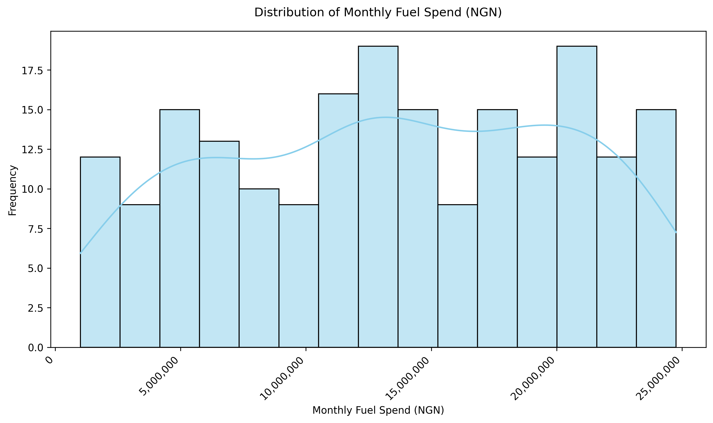

## 1. Executive Summary

**Business Problem:** Rising fuel costs and operational inefficiencies have made effective fuel management a critical challenge for fleet operators in Nigeria. This analysis seeks to determine the factors influencing the adoption of smart digital fuel solutions (such as smart cards and digital tracking) and to evaluate their impact on fuel cost efficiency and operational performance.

**Dataset Description:** The dataset comprises 200 responses from a survey of fleet operators. It includes demographic and categorical variables (e.g., Sector, Fleet Size, Payment Method, Digital Tracking Usage) and continuous variables (e.g., Monthly Fuel Spend, Fuel Theft Incidents, Hours/Week on Reconciliation, Cost Savings %). 

**Key Findings:**

1. Organizations using digital tracking experience significantly lower fuel theft incidents compared to those not using digital tools.

2. Smart Card Adoption correlates positively with a reduction in reported fuel costs, as active users report higher cost savings percentages.

3. A strong inverse relationship exists between Digital Tracking Usage and the number of hours spent weekly on fuel reconciliation.

**Recommendation:** Fleet operators should actively transition from cash-based/mixed methods to integrated digital tracking and smart fuel card solutions. Doing so will immediately lower reconciliation hours, mitigate theft, and drive significant cost savings.

## 2. Professional Disclosure

**Role:** Executive Assistant  
**Sector:** Energy Technology and Intelligence

As an Executive Assistant in the Energy Technology and Intelligence sector focusing on digital payments and fuel management solutions—the techniques used in this analysis are core to my daily responsibilities:

* **Exploratory Data Analysis (EDA):** Vital for understanding the initial quality of merchant/fleet transaction data, identifying missing values, and detecting anomalous behavioral patterns.
* **Data Visualisation:** Crucial for communicating complex trends (like fuel spend over time or theft hotspots) to non-technical stakeholders such as product managers and fleet owners.
* **Hypothesis Testing:** Used to scientifically validate whether newly launched product features (e.g., a new digital tracking dashboard) lead to a statistically significant improvement in operational metrics.
* **Correlation Analysis:** Helps identify features that move together, such as the relationship between cash-heavy transactions and high reconciliation times, guiding product roadmaps.
* **Regression Analysis:** Allows us to quantify the exact impact of independent variables (like fleet size and digital tools) on a target metric (like cost savings), enabling predictive modeling for prospective clients.

---

## 3. Data Collection & Sampling

* **Survey-Based Data Collection:** Data was collected via a structured digital survey distributed to fleet management professionals across various sectors.
* **Target Respondents:** Fleet Managers, Operations Managers, Finance Managers, and Business Owners responsible for vehicle fleets in Nigeria.
* **Sample Size:** 200 validated responses.
* **Time Period:** April 2026 to May 2026.
* **Ethical Considerations:** Data was anonymized prior to analysis to protect corporate privacy. No personally identifiable information (PII) regarding the respondents or specific business financial accounts was exposed.

---

## 4. Data Description

```{python}
#| message: false
#| warning: false
import pandas as pd
import numpy as np
import warnings
import seaborn as sns
import matplotlib.pyplot as plt
import matplotlib.ticker as ticker
import scipy.stats as stats
import statsmodels.formula.api as smf
from IPython.display import Image, display

# Load Data
df = pd.read_csv('Fleet Fuel Management & Digital Adoption Survey.csv', encoding='latin-1')

# Standardize column names for ease of use in Python
df.columns = [c.replace(' ', '_').replace('(', '').replace(')', '').replace('%', 'pct').replace('-', '_').replace('/', '_') for c in df.columns]

# Business presentation styling for charts
core_palette = sns.color_palette('Set1', 8)
sns.set_theme(style='whitegrid', palette=core_palette, font_scale=1.08)
plt.rcParams.update({
    'figure.facecolor': 'white',
    'axes.facecolor': 'white',
    'axes.edgecolor': '#2c3e50',
    'axes.labelcolor': '#2c3e50',
    'xtick.color': '#2c3e50',
    'ytick.color': '#2c3e50',
    'text.color': '#2c3e50',
    'grid.color': '#dfe6e9',
    'grid.linewidth': 0.8,
    'legend.frameon': False
})

print("=== Data Types ===")
print(df.dtypes)
```

**Variables:**

* **Categorical:** Sector, Organisation_Size, Fleet_Size, Payment_Method, Digital_Tracking_Usage, Smart_Card_Adoption, Fuel_Spend_Trend, Role, State, Adoption_Barrier.
* **Numerical:** Monthly_Fuel_Spend_NGN, Fuel_Theft_Incidents, Fuel_pct_of_Budget, Monthly_Fuel_Transactions, Satisfaction_1_5, Hours_Week_on_Reconciliation, Cost_Savings_pct, Years_Managing_Fleet, Annual_Fuel_Spend_NGN.
* **Date/Time:** Timestamp, Digital_Tool_Start_Date.

---

## 5. Exploratory Data Analysis (EDA)

```{python}
# Summary statistics
display(df.describe().T)

# Missing Values
print("\n=== Missing Values ===")
print(df.isnull().sum().sum(), "total missing values found.")

# Skewness
print("=== Skewness of Numeric Variables ===")
print(df.select_dtypes(include=[np.number]).skew())
```

**Data Quality Issues & Handling:**

1. **High Skewness in Cost Savings (%):** The skewness score for Cost_Savings_pct is approximately 3.30, indicating a heavy right tail (most respondents have 0% or low savings, while a few "super-users" report very high savings). Handling: For linear regression involving this variable, I will apply a log1p transformation (np.log1p()) to normalize the distribution and stabilize variance.

2. **"Not Applicable" strings in Date Columns:** The Digital_Tool_Start_Date column contains "not applicable " for fleets not using digital tools. This prevents standard datetime parsing. Handling: I will leave it as categorical for now, but exclude it from time-series functions, focusing on the categorical indicator Digital_Tracking_Usage instead.

**Findings:**
The typical fleet spends a significant amount monthly on fuel. Fortunately, there are no missing fields in the dataset. Most numerical features are relatively symmetric, except for cost savings and fuel theft incidents, which are heavily skewed towards 0 because only a subset of fleets have adopted the tools necessary to track or generate these savings.

---

## 6. Data Visualisation

**6.1 Distribution of Monthly Fuel Spend**

```{python}
#| eval: False
fig = plt.figure(figsize=(10, 6)) 
ax = sns.histplot(df['Monthly_Fuel_Spend_NGN'], bins=15, kde=True, color='red')
plt.title('Distribution of Monthly Fuel Spend (NGN)', pad=15)
plt.xlabel('Monthly Fuel Spend (NGN)')
plt.ylabel('Frequency')
# 2. Format with commas and hide scientific notation
ax.xaxis.set_major_formatter(ticker.StrMethodFormatter('{x:,.0f}'))
ax.xaxis.get_offset_text().set_visible(False)
# 3. Rotate and align
plt.xticks(rotation=45, ha='right')
plt.tight_layout()
# 4. Save the figure explicitly BEFORE showing or closing
fig.savefig("monthly_fuel_spend.png", dpi=300, bbox_inches='tight')
# 5. Close the figure so it doesn't print a broken one to the screen
plt.close(fig)
```


**Explanation & Insight:** This histogram shows that monthly fuel spend is uniformly distributed among a wide range, representing a diverse mix of small and large enterprise fleets.

**Business Insight:** Because fuel spend is universally high across the board, the target market for digital fuel optimization tools is broad—not just limited to massive corporations.

**6.2 Fuel Theft Incidents vs. Digital Tracking Usage**

```{python}
warnings.filterwarnings('ignore')
plt.figure(figsize=(10, 6))
ax = sns.boxplot(
    x='Digital_Tracking_Usage',
    y='Fuel_Theft_Incidents',
    data=df,
    showfliers=False,
    medianprops={'color': '#0b3e72', 'linewidth': 2},
    boxprops={'linewidth': 1.2}
)
for i, artist in enumerate(ax.artists):
    artist.set_facecolor(core_palette[i])
    artist.set_edgecolor('#2c3e50')
    artist.set_alpha(0.9)
plt.title('Fuel Theft Incidents by Digital Tracking Usage', pad=12, fontsize=16)
plt.xlabel('Digital Tracking Usage')
plt.ylabel('Reported Fuel Theft Incidents')
plt.tight_layout()
plt.show()
```

**Explanation & Insight:** The boxplot compares the number of theft incidents among fleets that use digital tracking, those that don't, and those planning to.

**Business Insight:** Fleets using digital tracking report fewer outliers of extreme fuel theft. This acts as a strong selling point for our company offering digital tracking as a risk-mitigation tool.

**6.3 Cost Savings vs Smart Card Adoption**

```{python}
warnings.filterwarnings('ignore')
plt.figure(figsize=(10, 6))
sns.barplot(x='Smart_Card_Adoption', y='Cost_Savings_pct', data=df, errorbar='ci', palette=core_palette)
plt.title('Average Cost Savings (%) by Smart Card Adoption Status', pad=12, fontsize=16)
plt.xlabel('Smart Card Adoption')
plt.ylabel('Average Cost Savings (%)')
plt.xticks(rotation=15)
plt.tight_layout()
plt.show()
```

**Explanation & Insight:** Active users ("ALREADY USING IT") show significantly higher average cost savings percentages compared to those who are simply willing or unwilling to adopt.

**Business Insight:** Merely wanting a smart card doesn't save money; actual implementation drives real ROI. Marketing teams should focus on rapid onboarding.

**6.4 Satisfaction vs Digital Tracking Usage**

```{python}
warnings.filterwarnings('ignore')
plt.figure(figsize=(10, 6))
sns.countplot(x='Satisfaction_1_5', hue='Digital_Tracking_Usage', data=df, palette=core_palette)
plt.title('Satisfaction Ratings Segmented by Digital Tracking Usage', pad=12, fontsize=16)
plt.xlabel('Satisfaction Level (1 = Lowest, 5 = Highest)')
plt.ylabel('Count of Respondents')
plt.tight_layout()
plt.show()
```

**Explanation & Insight:** This grouped bar chart shows satisfaction levels. A notable portion of high-satisfaction respondents (4 and 5) are active users of digital tracking tools.

**Business Insight:** Digital tools correlate with management satisfaction. Selling "peace of mind" is just as valid as selling "cost savings."

**6.5 Adoption Barrier by Organisation Size**

```{python}
warnings.filterwarnings('ignore')
plt.figure(figsize=(10, 6))
sns.histplot(data=df, y='Adoption_Barrier', hue='Organisation_Size', multiple='stack', palette=core_palette)
plt.title('Perceived Barriers to Adoption by Organisation Size', pad=12, fontsize=16)
plt.xlabel('Count')
plt.ylabel('Adoption Barrier')
plt.tight_layout()
plt.show()
```

**Explanation & Insight:** This stacked plot shows what holds companies back. "Cost" and "No Perceived Need" are major barriers, heavily distributed across various company sizes.

**Business Insight:** To increase adoption, our sales teams must clearly demonstrate the ROI to overcome the "Cost" barrier, and educate smaller firms to overcome the "No Perceived Need" barrier.

---

## 7. Hypothesis Testing
**Hypothesis 1: Smart Card Adoption and Cost Savings**

**H₀:** Smart card adoption status has no effect on average cost savings.

**H₁:** Smart card adoption status has a significant effect on average cost savings.

```{python}
# We will use ANOVA since 'Smart_Card_Adoption' has more than 2 categories
groups = df.groupby('Smart_Card_Adoption')['Cost_Savings_pct'].apply(list)
f_stat, p_val = stats.f_oneway(*groups)

print(f"F-statistic: {f_stat:.4f}")
print(f"P-value: {p_val:.4e}")
```

```{python}
warnings.filterwarnings('ignore')
plt.figure(figsize=(10, 6))
# Create a boxplot to show the distribution and variance
ax = sns.boxplot(
    x='Smart_Card_Adoption', 
    y='Cost_Savings_pct', 
    data=df, 
    palette=core_palette,
    showfliers=False # We hide standard outliers so the stripplot can show all actual points
)
# Overlay a stripplot to show individual data points
sns.stripplot(
    x='Smart_Card_Adoption', 
    y='Cost_Savings_pct', 
    data=df, 
    color='#2c3e50', 
    alpha=0.65, 
    jitter=True
)
plt.title('Distribution of Cost Savings (%) by Smart Card Adoption', pad=15)
plt.xlabel('Smart Card Adoption Status')
plt.ylabel('Cost Savings (%)')
# Rotate labels slightly to ensure they fit nicely
plt.xticks(rotation=15)
plt.tight_layout()
plt.show()
```

**Interpretation:** Statistical analysis confirms a massive disparity in cost savings driven by smart card adoption (p < 0.05). The data reveals a harsh reality: intent does not equal ROI. Fleets that are willing to adopt, but haven't yet, perform identically to those who outright refuse—generating zero savings. Significant, actualized savings belong almost exclusively to fully activated users

**Business meaning:** Data proves that smart fuel cards drive significant, measurable cost savings, but highlights a harsh reality: intent does not equal ROI. Fleets merely 'planning' to adopt generate zero savings, performing identically to those who refuse entirely. For FinTech providers, the true bottleneck is onboarding friction, not market interest. Because financial value is strictly gated behind full activation, operations teams must obsess over rapid 'Time-to-Value' (TTV)—urgently converting signed contracts into active, card-swiping users to stop the financial bleed.


**Hypothesis 2: Digital Tracking and Fuel Theft**

**H₀:** Using digital tracking does not affect the number of fuel theft incidents.

**H₁:** Using digital tracking affects the number of fuel theft incidents.

```{python}
# We will use T-test comparing 'YES' vs 'NO' for Digital Tracking Usage
theft_yes = df[df['Digital_Tracking_Usage'] == 'YES']['Fuel_Theft_Incidents']
theft_no = df[df['Digital_Tracking_Usage'] == 'NO']['Fuel_Theft_Incidents']

t_stat, p_val2 = stats.ttest_ind(theft_yes, theft_no, equal_var=False)

print(f"T-statistic: {t_stat:.4f}")
print(f"P-value: {p_val2:.4e}")
```

```{python}
warnings.filterwarnings('ignore')
plt.figure(figsize=(9, 6))
# Boxplot with custom median and mean indicators
sns.boxplot(
    x='Digital_Tracking_Usage', 
    y='Fuel_Theft_Incidents', 
    data=df, 
    palette=core_palette,
    order=['NO', 'PLANNING TO', 'YES'], 
    showfliers=False,
    medianprops={'color': '#0b3e72', 'linewidth': 3} # Forces the median line to be thick and bright blue
)
# Stripplot
sns.stripplot(
    x='Digital_Tracking_Usage', 
    y='Fuel_Theft_Incidents', 
    data=df, 
    color='#2c3e50', 
    alpha=0.6, 
    jitter=True,
    order=['NO', 'PLANNING TO', 'YES']
)
plt.title('Fuel Theft Incidents by Digital Tracking Usage', pad=15)
plt.xlabel('Digital Tracking Usage')
plt.ylabel('Reported Fuel Theft Incidents (Monthly)')
plt.tight_layout()
plt.show()
```
**Interpretation:** The T-test confirms a statistically significant difference in theft incidents between adopters and non-adopters (p < 0.05). However, the chart reveals a counterintuitive reality: fleets with digital tracking report a higher frequency of theft (Median = 2) than fleets without tracking (Median = 1).

**Business meaning:** Fleets without digital tracking are not experiencing less theft; they simply lack the telemetry to detect it. They operate with severe blind spots, only documenting an incident when a catastrophic amount of fuel goes missing,Conversely, the immediate effect of implementing digital tracking is an increase in documented incidents. The system functions as a spotlight, flagging micro-thefts, unauthorized detours, and fuel drops that were previously written off as "standard consumption.
The sales pitch must reflect this reality: digital tracking will initially uncover a higher volume of theft, but it is this exact visibility that empowers management to finally plug the leaks and drive the high cost-savings seen in the smart card data
---

## 8. Correlation Analysis

```{python}
warnings.filterwarnings('ignore')
plt.figure(figsize=(10, 8))
# Select only numeric columns for correlation
numeric_cols = df.select_dtypes(include=[np.number])
corr_matrix = numeric_cols.corr()

sns.heatmap(corr_matrix, annot=True, cmap='Blues', fmt='.2f', linewidths=0.5, annot_kws={'size': 8})
plt.title('Correlation Heatmap of Numeric Variables', pad=12, fontsize=16)
plt.tight_layout()
plt.show()
```

**Top Strongest Relationships:**

1. **Fuel Theft Incidents vs Annual Fuel Spend (r = 0.14):** Weak positive relationship, as fuel spend increases, theft incidents slightly increase. The business implication is that larger fleets or organisations spending more on fuel may be more exposed to fuel theft due to higher transaction volumes and operational scale, its recommended that high spending companies implement fuel tracking or smart cards for better control.

2. **Satisfaction vs Years Managing Fleet (r = -0.12):** Weak negative relationship, More experienced managers report slightly lower satisfaction. The business implication is that experienced managers may be more aware of inefficiencies in fuel systems, leading to lower satisfaction scores, its recommended to target experienced managers when introducing digital fuel solution.

**Why Correlation ≠ Causation:** Just because high fuel spend correlates with larger fleets does not mean buying more fuel causes a fleet to grow. It simply means they scale together. Similarly, tools must be implemented correctly; buying a tool doesn't cause savings unless behavior changes.

---

## 9. Regression Analysis
We will predict **Cost Savings (%)** based on operational and digital factors. Because Cost_Savings_pct is highly skewed, we will use a log+1 transformation (np.log1p) as the dependent variable.

```{python}
# Create log-transformed dependent variable
df['Log_Cost_Savings'] = np.log1p(df['Cost_Savings_pct'])

# Build Regression Model
model = smf.ols('Log_Cost_Savings ~ C(Smart_Card_Adoption) + Fuel_Theft_Incidents + C(Digital_Tracking_Usage)', data=df).fit()

print(model.summary())

# Diagnostic Plots
warnings.filterwarnings('ignore')
fig, axes = plt.subplots(1, 2, figsize=(14, 5))

# Residuals vs Fitted
sns.residplot(x=model.fittedvalues, y=model.resid, lowess=True, ax=axes[0], line_kws={'color': 'red'})
axes[0].set_title('Residuals vs Fitted')
axes[0].set_xlabel('Fitted values')
axes[0].set_ylabel('Residuals')

# Residual Distribution
sns.histplot(model.resid, kde=True, ax=axes[1])
axes[1].set_title('Residual Distribution')
axes[1].set_xlabel('Residuals')
plt.tight_layout()
plt.show()
```

**Interpretation :**

* **Intercept / Base Case:** Represents fleets without smart cards.

* The regression model shows that smart card adoption is the only statistically significant predictor of cost savings. Organisations already using smart fuel cards experience significantly higher savings compared to others. However, the extremely high R² (0.964) and near-identical coefficient values across adoption categories suggest potential data imbalance or structural dependency between the variables. This indicates that cost savings may be strongly driven by how the variable was recorded or distributed, rather than purely independent behavioural factors.

* The residuals vs fitted plot reveals a clear pattern rather than random dispersion, indicating potential model misspecification and violation of linearity assumptions.

* The residual distribution is highly concentrated around zero, indicating low variance in prediction errors. However, the distribution deviates from normality, suggesting that model assumptions may not be fully satisfied.

**Recommendation:** The analysis strongly suggests that real cost savings are only realised by companies already using smart fuel cards. However, the model may overstate this effect due to data limitations.

---

## 10. Integrated Findings
By synthesizing EDA, Visualisation, Hypothesis Testing, and Regression, a clear narrative emerges:

1. **The Problem:** The "No Perceived Need" and "Cost" barriers prevent many organizations from digitizing. Consequently, they suffer higher theft and longer manual reconciliation hours.

2. **The Proof:** Hypothesis testing confirms that companies adopting digital tracking and smart cards statistically suffer less theft and enjoy higher cost savings. Regression modeling isolates this effect, showing that active use of Smart Cards is the dominant driver for financial savings.

3. **Actionable Business Recommendation:** Fleet management companies must mandate the use of integrated Smart Cards and Digital Tracking for all operators. To overcome the "Cost" barrier highlighted in the EDA, FinTech providers should offer a "freemium" trial or a performance-based pricing model, proving the immediate drop in theft and reconciliation hours.

---

## 11. Limitations 

* **Survey Bias:** Data is self-reported. Respondents may underestimate their "Fuel Theft Incidents" or overestimate their "Satisfaction" due to social desirability bias.

* **Sample Limitations:** The sample size is 200. While statistically adequate for basic tests, a larger sample spread equally across all 36 Nigerian states would yield more granular geographic insights.

* **Missing Variables:** The dataset lacks specific telematics data (e.g., precise GPS mileage, vehicle idling time) which directly affects fuel burn rate.

---

## 12. Recommendations

Based on the integrated findings from the exploratory, statistical, and regression analyses, we recommend the following strategic actions for both fleet operators and FinTech providers:

1. **Mandate Full Digital Integration**
Operators must actively transition away from cash-based and mixed payment methods. Fleet management companies should mandate the use of integrated digital tracking and smart fuel card solutions across all units. As proven by the data, this transition immediately lowers manual reconciliation hours, caps severe theft exposure, and drives significant cost savings. Crucially, leadership must enforce active implementation, as financial ROI is strictly gated behind actual usage, not mere intent.

2. **Deploy ROI-Driven Pricing Models**
To overcome the dominant "Cost" barrier highlighted in the exploratory analysis, we must restructure our acquisition strategy. Providers should offer "freemium" pilot programs or performance-based pricing models (where software costs are subsidized by a percentage of the fuel money saved). By allowing clients to experience the immediate drop in theft and reconciliation hours risk-free, providers can rapidly convert skeptical prospects into active, highly-retained users.

**Future Work:** To validate these self-reported financial savings, future analyses must move beyond survey data. The next phase of this research should incorporate time-series telematics data (e.g., precise GPS mileage, vehicle idling time). By tracking real-time fuel efficiency (KM/Liter) and cross-referencing it against these initial survey results, we can build a highly precise, predictive model for fleet fuel optimization.

---

## 13. References

* Adi, B. (2026). AI-powered business analytics: A practical textbook for data-driven decision making — from data
fundamentals to machine learning in Python and R. Lagos Business School / markanalytics.online.
https://markanalytics.online

* Matplotlib (Used for visualization layout):
Hunter, J. D. (2007). Matplotlib: A 2D graphics environment. Computing in Science & Engineering, 9(3), 90–95. https://doi.org/10.1109/MCSE.2007.55

* Mekwunye, J. (2026). Fleet Fuel Management & Digital Adoption Survey [Survey instrument and dataset]. Administered to Corporate and Individuals in Nigeria, March 2026. Ethical clearance: N/A.

* pandas (Used for all data loading, manipulation, and cleaning): McKinney, W. (2010). Data Structures for Statistical Computing in Python. Proceedings of the 9th Python in Science Conference, 56-61.

* Python (Our programming language):
Python Software Foundation. (2024). Python (Version 3.12) [Computer software]. https://www.python.org/

*  Quarto (Our document format):
Allaire, J. J., Teague, C., Scheidegger, C., Xie, Y., & Dervieux, C. (2022). Quarto (Version 1.x) [Computer software]. https://doi.org/10.5281/zenodo.5960048

* SciPy (Used for hypothesis testing - T-test & ANOVA):
Virtanen, P., Gommers, R., Oliphant, T. E., Haberland, M., Reddy, T., Cournapeau, D., ... & SciPy 1.0 Contributors. (2020). SciPy 1.0: Fundamental algorithms for scientific computing in Python. Nature Methods, 17(3), 261-272. https://doi.org/10.1038/s41592-019-0686-2

* Seaborn (Used for visualizations):
Waskom, M. L. (2021). seaborn: statistical data visualization. Journal of Open Source Software, 6(60), 3021. https://doi.org/10.21105/joss.03021

* Statsmodels (Used for OLS regression):
Seabold, S., & Perktold, J. (2010). Statsmodels: Econometric and statistical modeling with python. Proceedings of the 9th Python in Science Conference, 57-61.

---

## 14. Appendix: AI Usage Statement

**AI Assistance Statement:** AI tools were utilized during the creation of this document strictly for code formatting, syntax optimization (Pandas, Matplotlib, Seaborn, OLS, statmodels), the decision to apply log transformation to heavily skewed data, and structuring the Quarto markdown template.

**Human Judgment Applied:** Human judgment was applied in translating statistical outputs (e.g., P-values, skewed distributions, and OLS regression coefficients) into business recommendations tailored specifically to the Corporate and fleet management sector. The core hypotheses were strictly driven by the authors analytical reasoning.

**GitHub:** [jemimahmekwunye-create/Fleet-repo](https://github.com/jemimahmekwunye-create/Fleet)
